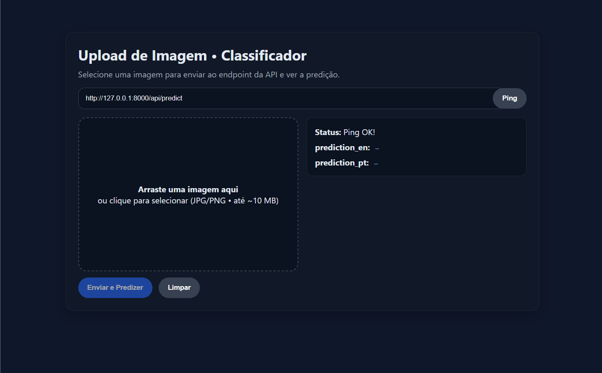

<h1 align="center">
  <b>🧬 API Copsocopia 🩸</b>
</h1>
    
### O Web Site pode ser encontrado em: https://github.com/Gabstaudt/Interface
### A aplicação em relação ao modelo se encontra neste repositório

O projeto consiste em uma API a ser aplicada na web, que objetiva fazer predição de Cancer Cervical com imagens de Coposcopia.
A base de dados utilizada para treinamento do modelo, foi a base pública: https://www.kaggle.com/datasets/jocelyndumlao/malhari-dataset


Grupo: Iumy Pimentel, Pamela Magalhães, Gabriella Staudt, Agatha, João Vitor.

Projeto desenvolvido na Universidade do Estado do Pará.

# ✨ Como rodar o projeto ✨ 

## 🧪 Tecnologias Utilizadas

- Python
- FastAPI

## 🚀 Começando

Clone o repositório:

```bash
https://github.com/Iuky-O/API_COPOSCOPIA.git
```

Abra no seu editor de código

## Criando o ambiente virtual

### 1. Criando

```bash
python -m venv venv
```
ou

```bash
python3 -m venv venv
```

### 2. Ativando
 
**🔹 Windows (CMD ou PowerShell):**
```bash
venv\Scripts\activate
```

**🔸 Linux / MacOS:**
```bash
source venv/bin/activate
```

### 3. Instalando as dependências

```bash
pip install -r requirements.txt
```

## 📚 Rodando

Não esqueça de configurar seu .env e settings.toml na raiz do projeto.

Para rodar você só precisa rodar este comando no terminal:

```bash
uvicorn main:app --reload
```

Acesse com: http://127.0.0.1:8000

Seu modelo será baixado e você poderá entrar na documentação da API, com:

```bash
http://127.0.0.1:8000/docs
```

Além disso, também pode rodar o front-end, tendo acesso a parte visual:


___
<p align="center">
  <b>Feito com ❤️ por</b> <a href="https://github.com/Iuky-O"><b>Iuky-O</b></a>
</p>

